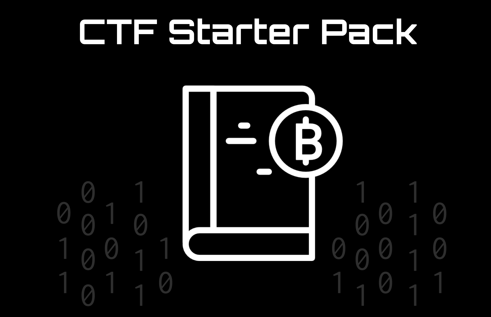

Esse projeto pretende oferecer as ferramentas e conteúdos básicos para um entusiasta de segurança da informação participar de uma das principais competições da àrea: as Capture The Flags ou CTFs.

O projeto possui as seguintes documentos:

- [Guia inicial](guides/summary.md) para essas competições.
- [Resoluções](https://github.com/AndrewIjano/ctf-starter-pack/tree/master/write-ups) de alguns problemas desses eventos.
- [Ferramentas](tools/README.md) para essas competições.

O guia está disponível na [wiki do IMEsec](https://wiki.imesec.ime.usp.br/).
