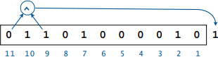

# One-Time Pad

Por muitos anos, o problema de esconder os padrões da língua ainda persistia, porém no final do século XIX surgiu aquele que seria o método mais forte de criptografia: o __one-time pad__.

## Funcionamento

Primeiro, precisamos gerar uma sequência __aleatória__ de bits do __mesmo tamanho__ da mensagem, essa será o _one-time pad_. Essa chave deverá ser passada por um meio seguro para o destinatário.

Para esse exemplo, usaremos codificação em [base64](../encodings/base64.md) para os caracteres.
```
mensagem:     H O P E
one-time pad: y T 2 5
```

Depois, vamos criar o texto cifrado a partir da mensagem e do one-time pad. Para isso, codificaremos a mensagem e o one-time pad em binário e realizamos a operação de __ou exclusivo__ bit a bit, ou __XOR__.

> A __operação XOR__ de dois bits retorna 1, se eles forem diferentes, e 0, se forem iguais.

```
mensagem:      H O P E ->  000111 001110 001111 000100
one-time pad:  y T 2 5 ->  110010 010011 110110 111001
                           |
                       XOR |
                           V
texto cifrado: 1 d 5 9 ->  110101 011101 111001 111101
```

Já para recuperar a mensagem, usamos exatamente a mesma operação, realizando um XOR bit a bit com o texto cifrado e o one-time pad.

Após __um uso__, o one-time pad deverá ser destruído.

## A criptografia perfeita
No final da década de 1940, [Claude Shannon](https://pt.wikipedia.org/wiki/Claude_Shannon) provou que se cada chave for usada __uma única vez__ e ela for gerada __aleatoriamente__, então o método de one-time pad é __perfeitamente seguro__.

Isso pode ser visualizado pelo seguinte exemplo: digamos que temos uma mensagem de 24 bits, logo temos 2^24 possíveis valores para a chave.

A partir disso, temos dois problemas. Mesmo se pudéssemos checar 1 milhão de valores por segundo, ainda levaríamos mais de 5 anos para checar todas as possibilidades. Outro problema é que cada possível chave gera uma possível mensagem com igual probabilidade das demais, assim se checarmos todas as chaves, veríamos todas as combinações possíveis de mensagens de 24 bits.

chave    | possível mensagem
----     | ------
A A A A  | 1 d 5 9
A A A B  | 1 d 5 8
...      | ...  
+ J z 5  |  L U K E
...      | ...
y T 2 5  |  H O P E
...      | ...  

Dessa forma, não há como distinguir a mensagem real de todas as outras possibilidades.

Entetanto, mesmo a técnica de One-time pad sendo simples e teoricamente inquebrável, na prática ela possui alguns pontos negativos, que costumam trazer suas vulnerabilidades:

- A chave precisa ser __usada uma única vez__. Se repetida, ela pode ser facilmente quebrada. Essa era a principal vulnerabilidade de uma cifra semelhante, a [Cifra de Vernam](http://www.cryptomuseum.com/crypto/vernam.htm).

- Ainda é preciso de um __canal seguro__ para distribuir as chaves.

- Conseguir __bits realmente aleatórios__ é bem difícil. O exército dos Estados Unidos conseguiu decifrar, em 1944, as mensagens alemãs cifradas por one-time pad porque as chaves não eram completamente aleatórias.

- A chave precisa ser __tão longa quanto a mensagem__. Isso implica numa grande dificuldade de gerar e armazenar chaves para mensagens longas.  

Esses dois últimos pontos, especialmente, acabam tornando o one-time pad teórico impraticável.

## Linear Feedback Shift Register
Como alternativa às longas sequências de bits realmente aleatórias, foi criado um algoritmo determinístico capaz de produzir valores __pseudo-aleatórios__: o __linear feedback shift register__ ou __LFSR__.

Valores pseudo-aleatórios são sequências de bits que parecem ser aleatórias. Elas não são aleatórias de fato, pois são criadas por algoritmos determinísticos, mas, para efeitos práticos, tem as mesmas propriedades de sequências aleatórias.

Esses valores pseudo-aleatórios são criados da seguinte maneira:

Primeiro, precisamos de uma sequência de bits inicial, chamada de __seed__. Essa _seed_ dará o tamanho do __registrador__, que é um elemento que armazena todos os bits necessários para gerar o próximo.

Depois, geraremos uma nova sequência através da operação _XOR_ de dois bits, colocando os bits resultantes à direita.



Por exemplo, a imagem acima representa o registrador com a _seed_. Nela, os bits 11 e 9 foram escolhidos para gerar o próximo. Essas posições são chamadas de __tap__, ela é uma numeração que começa do 1, indo da direita para esquerda.

Para descrever essas posições do algoritmo, usamos a notação `[N, k] LFSR`, que representa um algoritmo de LFSR com um registrador de `N` bits com _taps_ em `N` e `k`. Na imagem acima, temos um `[11,9] LFSR`.

Abaixo, está uma pequena simulação de um `[5,4] LFSR` com a _seed_ `00001`.
```
[5,4] LFSR

            novo bit
               V
seed ->  00001 0
         00010 0
         00100 0
         01000 1
         10001 1
         00011 0
         00110 0
         01100 1
         11001 0
         10010 1
         00101 0
           ^
      registrador
```

Assim, precisamos apenas criar uma lista de pequenas _seeds_ e distribuí-las por um canal seguro, usando elas para criar chaves do one-time pad, por meio do LFSR.

## Exercícios
[Krypton 6](http://overthewire.org/wargames/krypton/krypton6.html)

## Referências

[Khan Academy](https://en.khanacademy.org/computing/computer-science/cryptography/crypt/v/one-time-pad)

[Computer Science - Sedgewick & Wayne](https://www.ime.usp.br/~yoshi/Sedgewick/cos126.2017i/CS.00.Prologue.pdf)

[Mensagens alemãs não aleatórias](http://users.telenet.be/d.rijmenants/en/onetimepad.htm)
