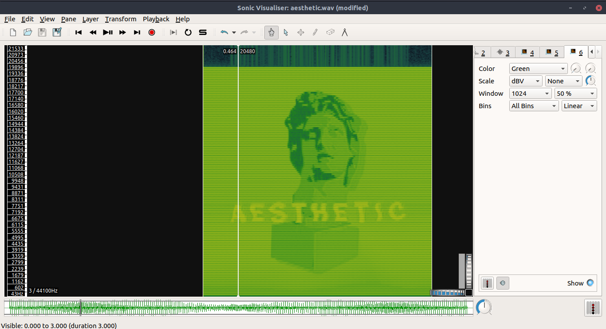
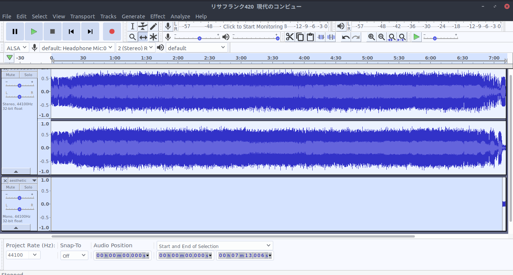
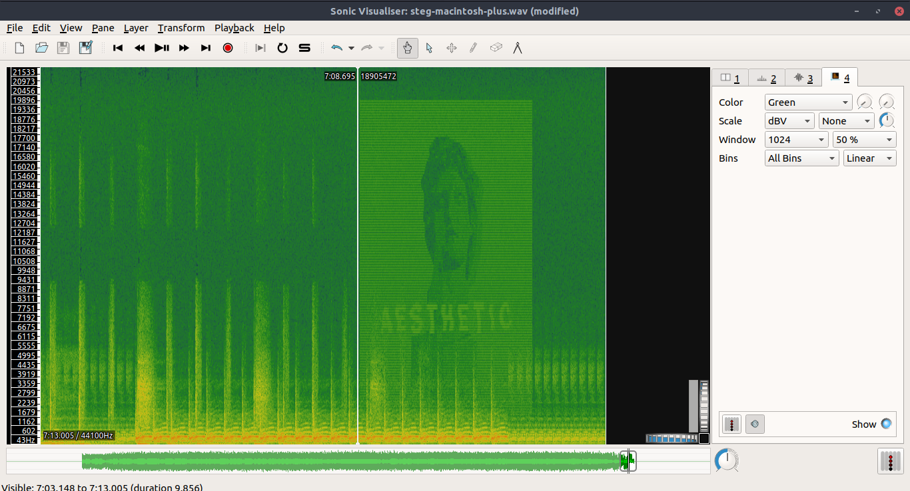

# Imagem em áudio

Mais uma forma interessante de esteganografia é esconder uma imagem em um áudio. Nela, a imagem é transformada em ondas sonoras de forma que ela pode ser vista através de seu __espectrograma__.

## O espectrograma
Um espectrograma é uma forma de visualizar a intensidade de um sinal através do tempo e em várias frequências.

Os espectrogramas são gráficos de duas dimensões (frequência x tempo), com a terceira dimensão, a frequência, sendo representada pela variação das cores. O __tempo__ é normalmente representado no eixo x em sentido crescente. Já a __frequência__ (medida em Hz) é representada no eixo y, com frequências mais baixas em baixo e mais altas em cima. Por fim, a __amplitude__ (medida em dB) é representada com cores mais escuras para amplitudes menores e cores mais claras para maiores.

Para visualizar o espectrograma de um áudio, pode-se usar o programa [sonic visualizer](https://www.sonicvisualiser.org/) (mais simples) ou [audacity](https://manual.audacityteam.org/index.html) (mais robusto).
## Escondendo uma imagem em um áudio
Primeiro, precisamos realizar a conversão da imagem para o áudio. Isso pode ser feito utilizando a ferramenta [img-encoder](https://github.com/alexadam/img-encode), no GitHub.

Por exemplo, se queremos converter a imagem `aesthetic.png`

No [demo online](https://alexadam.github.io/demos/img-encode/index.html) dessa ferramenta, adicionamos a imagem em `Open-Image...`, e convertemos com  `Encode`. Renomearemos o resultado para `aesthetic.wav`.

Utilizando o `sonic-visualizer` para visualizar o áudio gerado, mudamos a visualização para  `Add spectrogram`, com o comando `Shift+G`.

Agora, precisamos juntar esse áudio em outra música para camuflar a informação. Por exemplo, usaremos a música `リサフランク420  現代のコンピュー.mp3`. Abrindo a música com `audacity`, importamos o nosso áudio com `Ctrl+Shift+i`.

Com a ferramenta `Time Shift Tool`, podemos mudar a posição do áudio esteganográfico para o começo ou fim (assim a música vai interferir menos o áudio).

Porém, o áudio esteganográfico ainda pode ser percebido devido a seu ruído. Para diminuir esse efeito, primeiro selecionamos a _track_ do áudio (clicando em uma 'área neutra' do Painel de Controle, na parte esquerda da _track_) e clicando em `Effect` e `Amplify`. Assim, podemos mudar a amplitude do som para dificultar sua detecção (algo em torno de -20 dB).

Assim, selecinando todas as _tracks_ e exportando a música gerada para WAV, `steg-macintosh-plus.wav`, teremos uma música audível mas com uma imagem escondida em seu espectrograma.

## Exercícios
[HackTheBox: Milkshake](../../challenges/HackTheBox/Milkshake/Milkshake.md)

## Referências

[PNSN: Espectrogramas](https://pnsn.org/spectrograms/what-is-a-spectrogram)

[Selecionando Tracks no Audacity](https://ttmanual.audacityteam.org/man/Audacity_Selection)

[Mental Floss](http://mentalfloss.com/article/61815/how-musicians-put-hidden-images-their-songs)
