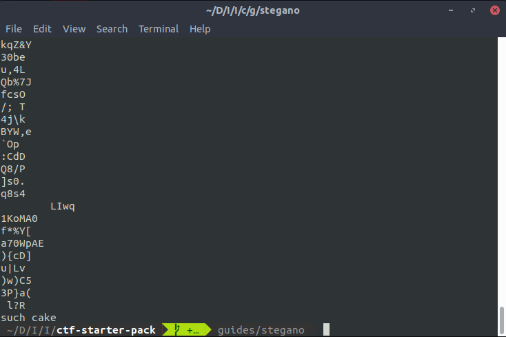

# Interpretar imagem como texto

Como foi explicado na seção de [dados e códigos](../encodings/introduction.md), qualquer arquivo no computador pode ser interpretado como uma sequência binária, e dessa forma, tem sua representação em texto. Assim, esse recurso pode ser usado para esconder informação numa imagem.

Um recurso comum em CTFs é colocar um trecho de texto puro em alguma região arbitrária da imagem. Por exemplo, se queremos esconder a palavra `such cake` na imagem `doge.jpg`, podemos usar o comando Linux:

```bash
echo "such cake" >> doge.jpg
```

Com isso, `"such cake"` ficará no final dos dados da imagem.

## Solucionando

Para extrair a informação escondida por esse método, várias ferramentas podem ser usadas. As duas principais são os comandos de Linux `strings` e `hexdump`.

O comando `strings` imprime basicamente todas as sequências de dados _imprimíveis_ de um arquivo. Por exemplo, o comando aplicado a imagem `doge.jpg`

```bash
strings doge.jpg
```

Com isso, o final da saída do comando será algo da forma:



Já o comando `hexdump` permite que a imagem seja analisada de forma mais minuciosa, onde o formato de leitura e impressão pode ser especificado pelo usuário. Por exemplo, um uso do comando com a imagem `doge.jpg`, onde a flag `-C` representa a forma canônica de impressão hex+ASCII:

```bash
hexdump -C doge.jpg
```

O final da saída desse comando é algo da forma:


## Exercícios
[WeChall: Stegano I](https://www.wechall.net/challenge/training/stegano1/index.php)

[picoCTF-2018: hex-editor](../../challenges/picoCTF-2018/hex-editor/hex-editor.md)
## Referências
[HowtoForge](https://www.howtoforge.com/linux-strings-command/)

[Sanfoudry](https://www.sanfoundry.com/10-practical-hexdump-command-usage-examples-in-linux/)
