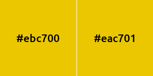
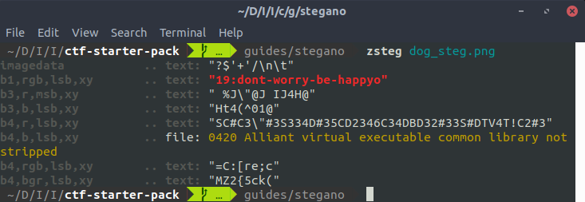

# LSB: Least Significant Bits

Um dos métodos mais comuns e populares nos dias de hoje para se esconder uma mensagem numa imagem é a técnica de __LSB__ ou __Least Significant Bits__. Esse método consiste em esconder a informação nos bits menos significativos de uma imagem.

## Representação da imagem

Como mencionado em [Dados e Códigos](../encodings/introduction.md), todos os arquivos no computador são sequências binárias e com as imagens não é diferente.   

Uma imagem é composta, na maioria das vezes, por duas partes. O __cabeçalho__ (ou _header_) é onde ficam armazenadas as informações sobre a imagem, como o seu formato e dimensões. Já o __corpo__ da imagem é onde ficam armazenados a informação dos seus _pixels_ de fato.

Cada formato tem suas particularidades para representar um pixel, por simplicidade vamos considerar um  pixel de 24 bits de uma [imagem lossless](https://en.wikipedia.org/wiki/Lossless_compression).

Por exemplo, um pixel com a cor em RGB `#ebc700` teria sua representação em binário como `11101011 11000111 00000000` onde

|  Red   |  Green |  Blue  |
| -----  | ------ | -----  |
| 8 bits | 8 bits | 8 bits |
|11101011|11000111|00000000|

## Escondendo na imagem por LSB
Para esconder informação em uma imagem usando o método de LSB, alteraremos os bits menos significativos de cada byte no corpo da imagem.

Por exemplo, se temos uma imagem de três pixels
```
pixel 1: 11101011 11000111 00000000
pixel 2: 01000010 10000110 11110100
pixel 3: 11110100 01010111 01000010
```
Se queremos esconder o byte `01100001`, uma nova imagem será gerada com a mensagem nos últimos bits (destacado por \* \* ).
```
pixel 1: 1110101*0* 1100011*1* 0000000*1*
pixel 2: 0100001*0* 1000011*0* 1111010*0*
pixel 3: 1111010*0* 0101011*1* 01000010
```

Dessa forma, ao esconder a mensagem nos bits menos significativos, fazemos apenas uma pequena alteração na imagem. Por exexmplo, o `pixel 1` foi da cor `#ebc700` para `#eac701`.



Assim, vemos que a imagem precisa ser maior que a mensagem que vamos esconder nela. Nessa caso, no mínimo __8 vezes maior__. Para contornar esse problema, alguns algoritmos usam 2 ou 3 bits menos significativos de cada byte, aumentando a alteração da imagem.

Para recuperar a mensagem, fazemos o processo inverso: identificando os bits menos significativos no corpo e remontando em bytes.

```
pixel 1: 1110101*0* 1100011*1* 0000000*1*
pixel 2: 0100001*0* 1000011*0* 1111010*0*
pixel 3: 1111010*0* 0101011*1* 01000010

-> mensagem: 01100001
```

## Ferramentas para LSB

### Stéganô

O pacote Stéganô possui várias ferramentas para esteganografia. A maioria sua a técnica de LSB.

Ele necessita de __Python 3__ e pode ser instalado por
```bash
sudo pip3 install Stegano
```

Uma das ferramentas desse pacote é o comando `stegano-lsb`.

Ele pode ser usado para esconder uma mensagem em uma imagem com o argumento `hide`, como por exemplo

```bash
stegano-lsb hide -i dog.png -o dog_steg.png -m "dont-worry-be-happy"
```
Já com o comando `reveal`, podemos recuperar a mensagem a partir da imagem.
```bash
stegano-lsb reveal -i dog_steg.png
```

Além disso, em vez de modificar os pixels sequncialmente a partir do começo, um outro comando, o `stegano-lsb-set`, permite inserir a informação de acordo com outros padrões especificados. Ele recebe um argumento para um gerador, como por exemplo `eratosthenes`, que produz os pontos onde os pixels serão modificados.

Assim, é preciso usar o mesmo gerador para esconder e recuperar a mensagem:

```bash
stegano-lsb-set hide -i dog.png -o dog_steg2.png -g eratosthenes -m "dont-worry-be-happy"

stegano-lsb-set reveal -i dog_steg2.png -g eratosthenes
```

### zsteg

O zsteg é uma ótima e super simples ferramenta para __detectar__ steganografia em imagem. Ela necessita de [Ruby](https://www.ruby-lang.org/pt/documentation/installation/) e pode ser instalada por

```bash
gem install zsteg
```

Para detectar uma informação escondida por um LSB simples, pode-se digitar apenas

```
zsteg dog_steg.png
```

O resultado será algo como



## Informações adicionais

Muitas vezes, a técnica de LSB pode ser usada junto a uma __criptografia__ para proteger ainda mais a mensagem e dificultar sua detecção.

Na vida real, a técnica de LSB pode ser usada como __marca d'água digital__ para detectar cópias de mídias não autorizadas. O programa [OpenStego](https://www.openstego.com/) é um ótimo exemplo de software com essa finalidade.

## Exercícios
(to-do)

## Referências

[Computerphile](https://www.youtube.com/watch?v=TWEXCYQKyDc&t=329s)

[Stéganô](https://wiki.cedricbonhomme.org/security:steganography?do=)

[zsteg](https://github.com/zed-0xff/zsteg)
