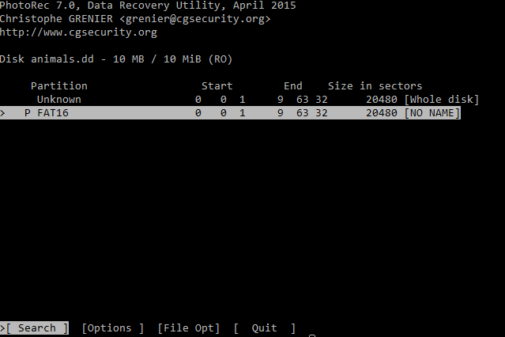
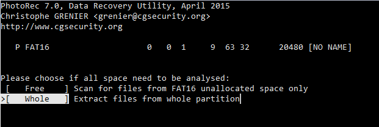
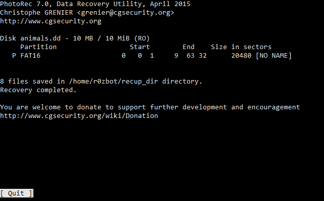

# picoCTF - 2018: Recovering From the Snap

**Categoria:** Forensics
**Pontos:** 150
**Descrição:**

> There used to be a bunch of [animals](animals.dd) here, what did Dr. Xernon do to them?
>
> Hints:
> 
> Some files have been deleted from the disk image, but are they really gone?

## Write-up

A ideia desse desafio é simplesmente recuperar um arquivo excluido de um sistema de arquivos. 
Para isso, é possível usar uma grande quantidade de ferramentas, tando no Windows quanto no Linux.
Nesse caso, vamos utilizar a ferramenta PhotoRec. 
Ele faz parte do pacote testdisk, então caso precise instalá-lo, use:
`sudo apt-get install testdisk` ou `pacman -S testdisk`

Seu uso é muito simples: basta executar o comando `photorec caminho`, 
sendo que esse caminho pode ser tanto um arquivo de imagem (como é o nosso caso) quanto uma partição do sistema (ex: /dev/sda1).

Portanto, no nosso caso, basta executar `photorec animals.dd`:

Pressionando enter, procedemos para a próxima tela. Aqui, precisamos selecionar a partição que queremos examinar, nesse caso é a opção FAT16:

Na próxima tela, selecionamos `Other` pois não é um sistema de arquivos Ext:

Em seguida, precisamos escolher se queremos escanear o disco inteiro ou só a parte não usada (ou seja, os arquivos que realmente foram excluidos). No nosso caso, como é uma imagem pequena com poucos arquivos, podemos escolher a opção `Whole Disk`, que vai extrair todos os arquivos dessa imagem, excluidos ou não:

Em seguida, selecione a pasta onde os arquivos vão ser extraidos e pressione `c. Você verá um resultado como esse, que significa que 8 arquivos foram extraídos com sucesso:

Agora só precisamos olhar pra eles e ver qual deles tem a flag :)

